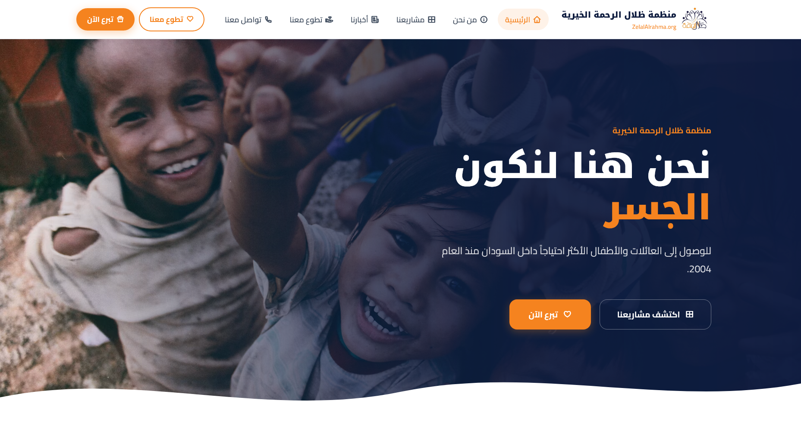
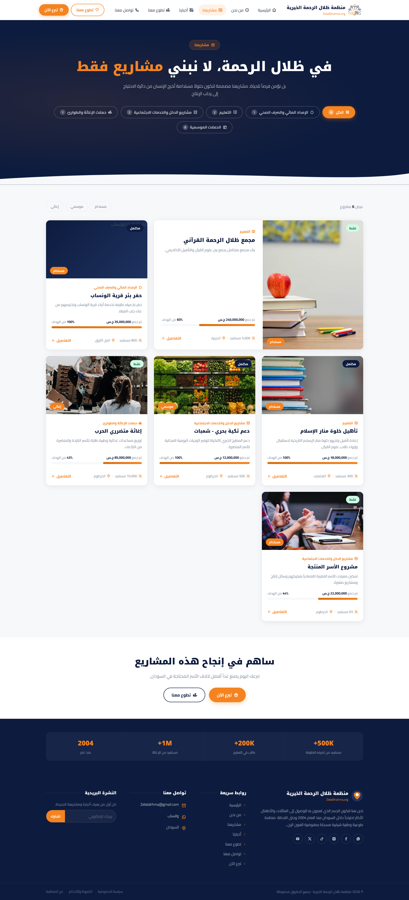
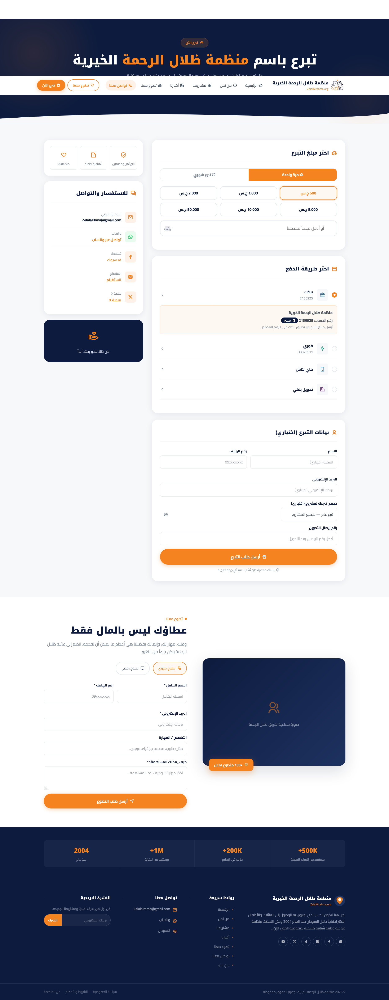

# 🌿 Zelal Al-Rahma Charity Platform (منظمة ظلال الرحمة الخيرية)

A modern, responsive web application designed for **Zelal Al-Rahma**, a registered Sudanese volunteer-led youth humanitarian organization founded in 2004. The platform connects donors, volunteers, and those in need, facilitating transparent project discovery, manual donation management, volunteer applications, and field updates.

---

## 📸 Interface Preview

### 1. Home Page & Interactive Bento Grid



### 2. Projects Catalog & Progress Tracking



### 3. Donation & Volunteer Forms



---

## 🌟 Key Features

-   **Interactive Category Bento Grid:** Visual-heavy bento grid highlighting core sectors: Water Supply, Education, Productive Families, and Emergency Relief.
-   **Dynamic Projects Catalog:** Fully filterable directory showcasing funding status, target vs. raised amounts, progress percentages, and beneficiary counts.
-   **Secure Manual Donation Flow:** Supports manual verification steps for regional payment gateways like _Bankak_, _Fawri_, and _MyCash_.
-   **Integrated Volunteering & Contact System:** Responsive forms targeting professional or digital youth volunteer recruitment.
-   **Field Updates Timeline:** Eager-loaded galleries showing milestone completions directly within project detail pages.
-   **Auto-Calculated Impact Statistics:** Dynamic runtime calculation of overall beneficiaries, completed projects, and active volunteers across the database.

---

## 🛠️ Built With

-   **Backend Framework:** Laravel 11.x (PHP 8.2+)
-   **Frontend Styles:** Tailwind CSS v4.0 & Custom CSS Tokens (RTL optimized)
-   **Icons:** Remix Icon Library v4.2
-   **Database:** SQLite (Default, easily switchable to MySQL/PostgreSQL)

---

## 🚀 Getting Started

Follow these steps to set up the project locally for development or presentation:

### 1. Clone the Repository

```bash
git clone https://github.com/yourusername/zillalrahma.git
cd zillalrahma
```

### 2. Install Dependencies

```bash
composer install
npm install && npm run build
```

### 3. Environment Setup

Copy the example environment file and generate the application key:

```bash
cp .env.example .env
php artisan key:generate
```

_Note: The default database is set to SQLite. The system will automatically create the `database.sqlite` file if it does not exist._

### 4. Database Migrations & Rich Seed Data

Run the migrations and seed the database with structured categories, projects, high-resolution image galleries, mock donations, and local partners:

```bash
php artisan migrate:fresh --seed
```

### 5. Start the Local Server

```bash
php artisan serve
```

Open your browser and navigate to `http://localhost:8000`.

---

## 📂 Database Seeding Structure

To make your client presentation cohesive, the default seeds populate six realistic projects with imagery linked directly from fast, high-quality, non-profit Unsplash photography:

1. **Zelal Al-Rahma Quran Complex** (Education)
2. **Al-Wansab Village Water Well** (Water & Sanitation)
3. **Manar Al-Islam Retreat Rehab** (Education)
4. **Bahri Soup Kitchen (Takiya)** (Relief & Emergency)
5. **War-Displaced Families Relief** (Relief & Emergency)
6. **Productive Families Support** (Income & Social Services)

---

## 📄 License & Attribution

This project is developed for **Zelal Al-Rahma Charity Organization**. All media assets sourced from Unsplash are owned by their respective photographers and are intended for demonstration purposes.
